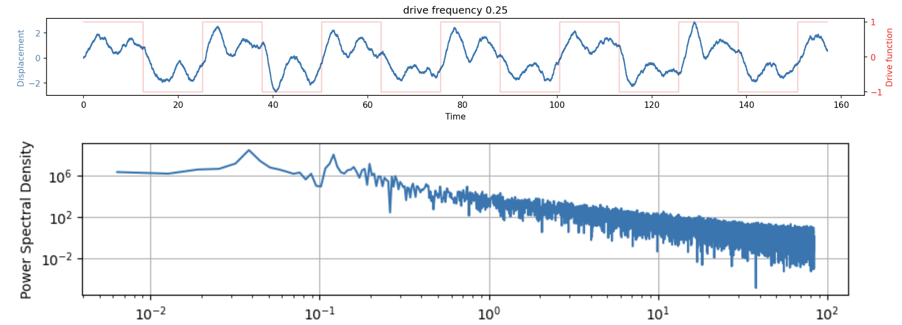

# Radial Isochron and Harmonic Oscillator with Langevin Noise and Customizable External Drive
Lightweight power spectrum plotter included

### Harmonic Oscillator Model
$$\begin{align}
dv &= F(t)dt - \frac{k}{m}x(t) dt-\frac{\gamma}{m} v(t) dt+dW_v\\
dx &= v(t)dt + dW_x
\end{align}$$

### Radial Isochron Model
$$\begin{align}
dr = \alpha (\mu r dt -r^3 dt) + dw_r \\
d\phi =\omega dt+ k\,sin(F(t)-\phi) +dw_{\phi}
\end{align}
$$

$F(t)$ is a customizable drive function.
In both models, odeint is used to integrate in the absence of noise, otherwise Euler–Maruyama method is used.

